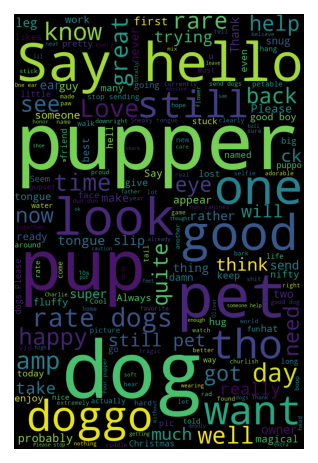

# WeRateDogs Data Analysis

Data analysis of the WeRateDogs tweets (https://twitter.com/dog_rates) using statistical inference.

  

### Table of Contents

1. [Project Motivation](#motivation)
2. [Installation](#installation)
3. [File Descriptions](#files)
4. [Results](#results)
5. [Licensing, Authors, and Acknowledgements](#licensing)

## Project Motivation

For this project I'm using a sample of the WeRateDogs tweets to answer the following questions regarding dog breeds:

1. What are the most commom breeds rated?

2. Which breeds are more likable?

3. Which breeds are more popular?

## Installation 

There should be no necessary libraries to run the code here beyond the standard Google's Colab environment. 

## File Descriptions 

There is one notebook available here to present the work related to the above questions. Markdown cells were used to assist in walking through the thought process for individual steps.

The data used for this project is on the data folder.

## Results

The main findings of the code can be found [here](act_report.html).

## Licensing, Authors, Acknowledgements

Credits to WeRateDogs and Udacity. 

The findings here are observational, not the result of a formal study.

This is a student's project, take a look at the [MIT Licence](LICENSE) before using elsewhere.
